# TellCo Telecom Data Analysis 📊📈📱

## 🌟 Project Overview

This project delivers a comprehensive data analysis of **TellCo's telecom dataset**, providing critical insights to inform a strategic investment decision. As an analyst for a wealthy investor, the goal is to uncover opportunities for growth and assess TellCo's overall value by examining customer behavior and network performance.

The diagram below illustrates the high-level data flow and analytical process:


## 🎯 Business Context & Objective

The investor specializes in acquiring undervalued assets and relies on detailed data analysis to understand business fundamentals and drive profitability. TellCo, a mobile service provider in the Republic of Pefkakia, has shared financial data but lacks insights from its system-generated data.

**Objective:** To analyze growth opportunities and recommend whether TellCo is a worthy acquisition, leveraging a detailed telecommunication dataset.

## 💾 Dataset

The analysis is based on a simulated **telecom xDR (data sessions Detail Record)** dataset, encompassing aggregated data from one month. It provides rich information on:

- **User Behavior:** Tracking activities across popular applications like Social Media, Google, Email, YouTube, Netflix, Gaming, and Others.
- **Network Performance:** Key metrics such as TCP retransmission, Round Trip Time (RTT), and Throughput.
- **Device Information:** Details on Handset Manufacturer and Handset Type.

## 🚀 Key Analysis Areas



The project systematically addresses four core sub-objectives to provide a holistic view of TellCo's operations and customer base:

### 1. User Overview Analysis 👤
Familiarizing with the dataset, identifying top handsets and manufacturers, and interpreting initial insights into user behavior and device preferences.

### 2. User Engagement Analysis 💡
Quantifying user engagement based on session frequency, duration, and total data traffic. This involves segmenting customers into different engagement clusters (e.g., low, medium, high) using K-Means clustering.

### 3. User Experience Analysis 🌐
Evaluating customer experience by focusing on critical network parameters like Average RTT, Average Throughput, and TCP Retransmission volumes. Users are segmented into experience groups to identify areas of poor service quality.

### 4. User Satisfaction Analysis 😊
A composite satisfaction score is derived by combining insights from both user engagement and experience analyses. This helps in identifying highly satisfied users and those at high risk of churn, providing a foundation for targeted retention strategies.

## ✨ Insights & Recommendations

The analysis culminates in a comprehensive investment recommendation for TellCo, backed by data-driven insights:

- **Growth Potential Assessment:** Identifying segments (e.g., high-engagement users, demand for high-bandwidth apps) that offer significant opportunities for revenue growth.
- **Limitations & Risks:** Acknowledging the constraints of the analysis (e.g., simulated data, lack of churn data, competitive landscape) and potential risks involved.
- **Strategic Recommendations:** Outlining actionable steps for post-acquisition, including network optimization, personalized offers, and churn prevention programs.

## 🛠️ Technical Stack

- **Language:** Python 🐍, SQL (T-SQL)
- **Database:** SQL Server
- **Data Manipulation:** pandas, numpy
- **Data Visualization:** matplotlib, seaborn, plotly
- **Machine Learning:** scikit-learn (for K-Means clustering, PCA)
- **Statistical Analysis:** scipy

## 🚀 Getting Started

To explore this project and run the analysis locally, follow these steps:

### 1. Database Setup (SQL Server)

First, set up your SQL Server database and load the telecom data. Ensure you have SQL Server installed and accessible.

1. **Create Database and Table:**  
   Execute the following SQL script:
   ```sql
   -- Create the database
   CREATE DATABASE TelecomAnalytic;
   GO
   
   USE TelecomAnalytics;
   GO
   
   -- Create main table structure
   CREATE TABLE UserSessions (
       BearerId BIGINT,
       StartTime DATETIME,
       StartMs INT,
       EndTime DATETIME,
       EndMs INT,
       DurationMs INT,
       IMSI BIGINT,
       MSISDN BIGINT,
       IMEI BIGINT,
       LastLocation NVARCHAR(100),
       AvgRttDL FLOAT,
       AvgRttUL FLOAT,
       AvgBearerTPDL FLOAT,
       AvgBearerTPUL FLOAT,
       TcpDLRetransVol INT,
       TcpULRetransVol INT,
       DLTPUnder50 FLOAT,
       DLTP50to250 FLOAT,
       DLTP250to1M FLOAT,
       DLTPOver1M FLOAT,
       ULTPUnder10 FLOAT,
       ULTP10to50 FLOAT,
       ULTP50to300 FLOAT,
       ULTPOver300 FLOAT,
       HttpDL INT,
       HttpUL INT,
       ActivityDurDL INT,
       ActivityDurUL INT,
       HandsetManufacturer NVARCHAR(100),
       HandsetType NVARCHAR(100),
       SocialMediaDL BIGINT,
       SocialMediaUL BIGINT,
       GoogleDL BIGINT,
       GoogleUL BIGINT,
       EmailDL BIGINT,
       EmailUL BIGINT,
       YoutubeDL BIGINT,
       YoutubeUL BIGINT,
       NetflixDL BIGINT,
       NetflixUL BIGINT,
       GamingDL BIGINT,
       GamingUL BIGINT,
       OtherDL BIGINT,
       OtherUL BIGINT,
       TotalUL BIGINT,
       TotalDL BIGINT
   );
   GO
    ```
2. **Load Data:**

    ```sql
       -- Bulk insert from CSV
       BULK INSERT UserSessions
       FROM 'dataset\Project5\telcom_data (2).xlsx - Sheet1.csv'
       WITH (
          FORMAT = 'CSV',
          FIRSTROW = 2,  -- Skips header row
          FIELDTERMINATOR = ',',
          ROWTERMINATOR = '\n',
          TABLOCK
         );
       GO
    ```

3. **Performance Optimization:**
    
   ```sql
      -- Create indexes for performance
      CREATE INDEX IX_UserSessions_MSISDN ON UserSessions(MSISDN);
      CREATE INDEX IX_UserSessions_Handset ON UserSessions(HandsetManufacturer, HandsetType);
      CREATE INDEX IX_UserSessions_Network ON UserSessions(AvgRttDL, AvgBearerTPDL);
      GO
      
      -- Create view for common aggregations
      CREATE VIEW UserEngagementSummary AS
      SELECT
         MSISDN AS UserID,
         COUNT(*) AS SessionCount,
         SUM(DurationMs) AS TotalDuration,
         SUM(TotalDL + TotalUL) AS TotalDataVolume,
         AVG(AvgBearerTPDL) AS AvgThroughput
       FROM UserSessions
       GROUP BY MSISDN;
       GO
     ```

4. **Stored Procedures for Analysis:**
   ```sql

      -- Procedure for manufacturer analysis
      CREATE PROCEDURE sp_ManufacturerAnalysis
      AS
      BEGIN
         -- Market share
         SELECT
         HandsetManufacturer,
         COUNT(*) AS UserCount,
         COUNT(*) * 100.0 / (SELECT COUNT(*) FROM UserSessions) AS MarketSharePercent
     FROM UserSessions
     GROUP BY HandsetManufacturer
     ORDER BY UserCount DESC;

     -- Data usage by manufacturer
     SELECT
         HandsetManufacturer,
         SUM(TotalDL)/POWER(1024,3) AS DownloadGB,
         SUM(TotalUL)/POWER(1024,3) AS UploadGB
     FROM UserSessions
     GROUP BY HandsetManufacturer
     ORDER BY DownloadGB DESC;
     END;
     GO

   -- Procedure for application usage
   CREATE PROCEDURE sp_ApplicationUsage
     @UserID BIGINT = NULL
   AS
   BEGIN
     SELECT
         ISNULL(@UserID, MSISDN) AS UserID,
         SUM(SocialMediaDL + SocialMediaUL)/POWER(1024,2) AS SocialMediaMB,
         SUM(GoogleDL + GoogleUL)/POWER(1024,2) AS GoogleMB,
         SUM(YoutubeDL + YoutubeUL)/POWER(1024,2) AS YoutubeMB,
         SUM(NetflixDL + NetflixUL)/POWER(1024,2) AS NetflixMB
     FROM UserSessions
     WHERE @UserID IS NULL OR MSISDN = @UserID
     GROUP BY MSISDN;
     END;
     GO
   ```

### 2. Clone the repository (for Python analysis):
```bash
    git clone https://github.com/tayade-aniket/Telecom-Data-Analysis-NHIS
    cd TellCo-Telecom-Data-Analysis
```

### 3. Install Dependencies (for Python analysis):
```bash
   pip install pandas numpy matplotlib seaborn plotly scikit-learn scipy
 ```

### 4. Run the Analysis (Python):
```bash
   jupyter notebook TellCo_Telecom_Analysis.ipynb
```

## 🛣️ Future Enhancements
Based on the project requirements, potential future enhancements include:
- **Dashboard Development:** Building an interactive web-based dashboard (e.g., using Streamlit or Flask) to visualize key findings.
- **Model Deployment & Tracking:** Implementing Docker and MLOps tools for model deployment and tracking.
- **Unit Testing & CI/CD:** Adding unit tests and setting up Continuous Integration/Continuous Deployment pipelines.
- **Database Integration:** Exporting final results to a SQL database.


## Authors

- [@tayade-aniket](https://github.com/tayade-aniket)